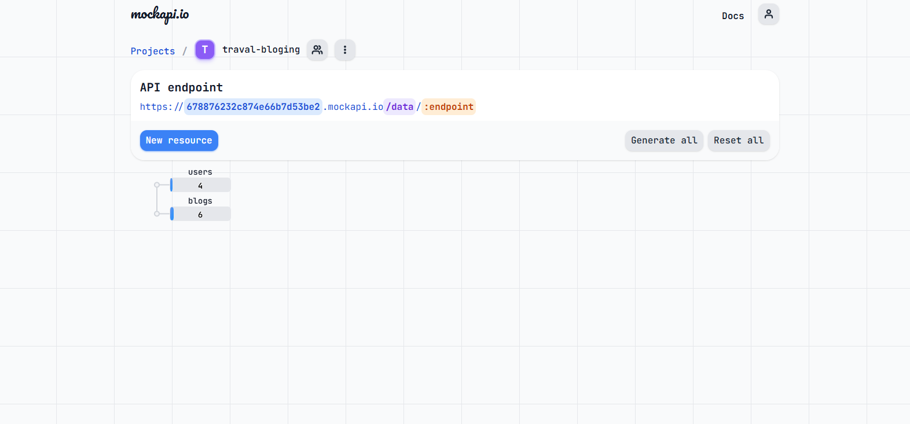
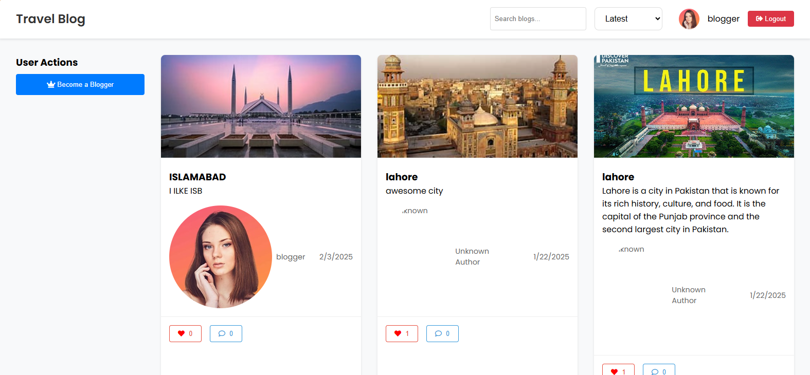
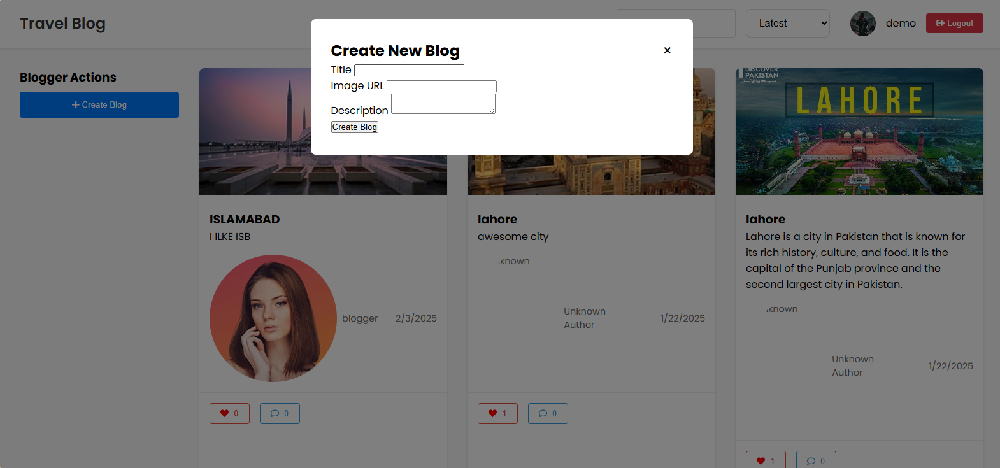
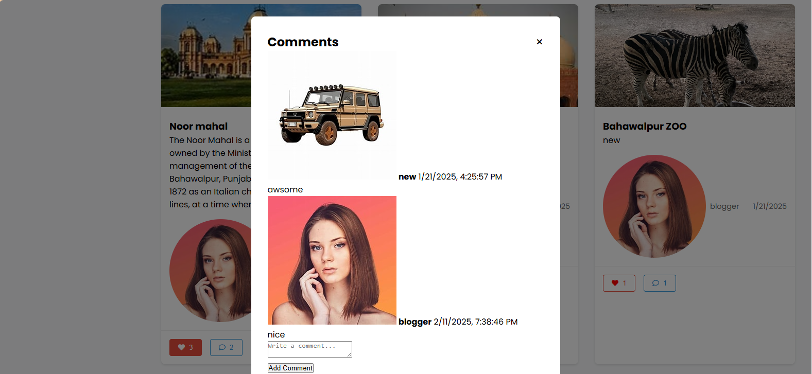

<div align="center">
      <h1> <br/>Travel Blog Platform</h1>
      <h3>A Modern Travel Blogging Community</h3>
</div>

<p align="center">
    <a href="https://jamalihassan0307.github.io/travel-blogging-platfoam/" target="_blank">
        
    </a>
    <a href="https://github.com/jamalihassan0307" target="_blank">
        
    </a>
    <a href="https://www.linkedin.com/in/jamalihassan0307/" target="_blank">
        
    </a>
</p>

## 🔐 Demo Credentials

### Admin Account

```json
{
  "email": "admin@gmail.com",
  "password": "1234",
  "name": "admin",
  "role": "Admin (roleId: 1)",
  "status": "approved"
}
```

### Blogger Account

```json
{
  "email": "blogger@gmail.com",
  "password": "1234",
  "name": "blogger",
  "role": "Blogger (roleId: 2)",
  "status": "normal"
}
```

### Regular User Account

```json
{
  "email": "new@gmail.com",
  "password": "1234",
  "name": "new",
  "role": "User (roleId: 2)",
  "status": "normal"
}
```

# 📌 Overview

Travel Blog is a dynamic web platform that connects travel enthusiasts and bloggers. Users can share their travel experiences, engage with other travelers through likes and comments, and manage their content through an intuitive interface.

# 🛠️ Tech Stack


## 📸 Screenshots

### API Configuration

<div align="center">
  
</div>

### Blog Dashboard

<div align="center">
  
  
</div>

### Content Creation

<div align="center">
  
  
</div>

### User Management

<div align="center">
  
  
</div>

### Engagement Features

<div align="center">
  
</div>

### Admin Dashboard

<div align="center">
  
</div>

## 🔑 Key Features

### For Bloggers

- Create and publish travel blogs
- Upload images and rich text content
- Engage with readers through comments
- Track post engagement (likes, comments)
- Choose between Basic and Pro subscription plans

### For Administrators

- Approve new blogger applications
- Monitor platform statistics
- Manage user accounts
- Review content moderation

### General Features

- Responsive design
- User authentication
- Social interactions (likes, comments)
- Real-time updates
- Image upload support

## 🚀 Getting Started

1. Clone the repository

```bash
git clone https://github.com/jamalihassan0307/travel-blogging-platfoam.git
```

2. Open with Live Server

```bash
# Use VS Code Live Server extension or your preferred method
```

3. Configure API

```bash
# Update API_BASE_URL in js/services/api.js with your MockAPI endpoint
```

## 👨‍💻 Developer Contact

Feel free to reach out for questions or collaboration:

- GitHub: [@jamalihassan0307](https://github.com/jamalihassan0307)
- LinkedIn: [Jamali Hassan](https://www.linkedin.com/in/jamalihassan0307/)

## 🙏 Acknowledgments

Special thanks to:

- MockAPI for backend services
- Font Awesome for icons
- All contributors and supporters
